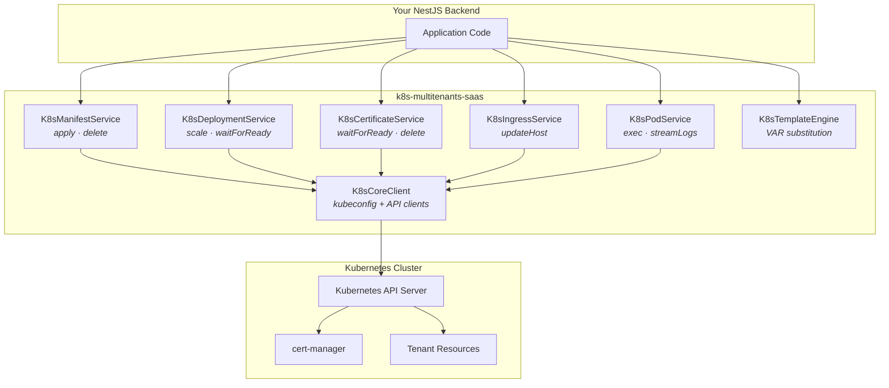
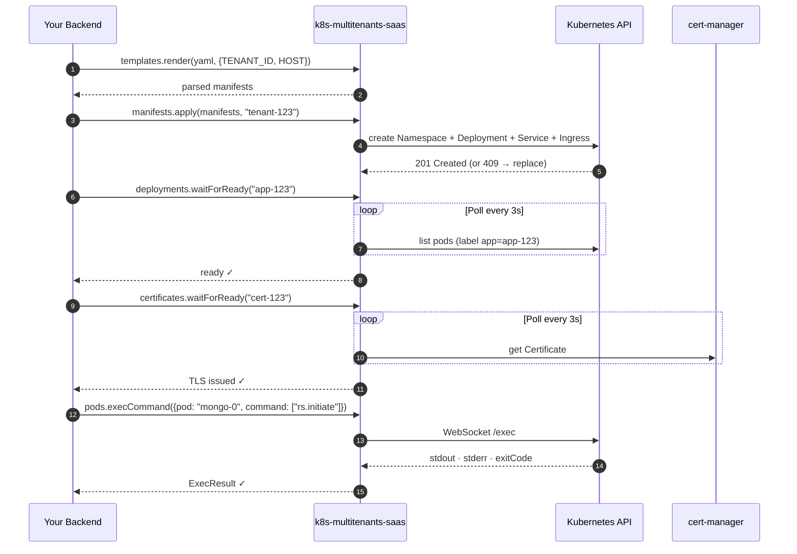

# k8s-multitenants-saas

> Programmatic Kubernetes for multi-tenant SaaS, built for NestJS.
> Apply manifests, wait for resources, exec into pods, manage tenant
> ingresses & TLS — without shelling out to `kubectl` or wrapping Helm.

## Why this exists

You're building a multi-tenant SaaS on Kubernetes. When a user signs up, your
backend needs to **provision real cluster resources**: a namespace, a config
map, an ingress for their custom domain, a TLS certificate via cert-manager,
maybe an `exec` to bootstrap state inside a pod.

You have two options today:

- **`@kubernetes/client-node`** — the official client. Powerful but very low
  level. You end up writing 600 lines of switch statements just to apply a
  manifest, plus your own retry logic, your own polling for cert-manager,
  your own idempotency.
- **Helm / ArgoCD** — great for declarative deploys, but not designed to be
  driven from a Node backend on every user signup.

This library lives in the gap: a small, opinionated NestJS module split into
focused services — manifests, deployments, certificates, ingresses, pods —
that give you the verbs you actually need to provision tenant resources at
runtime.

## Status

⚠️ **v0.1 — early.** Extracted from a production multi-tenant SaaS.
API may evolve. Not yet on npm.

## Architecture



Each service is independently injectable. Use only what you need.

## A typical tenant provisioning flow



## Install

```bash
npm install k8s-multitenants-saas @kubernetes/client-node
```

## Quickstart

```ts
import { Module } from '@nestjs/common';
import { KubernetesModule } from 'k8s-multitenants-saas';

@Module({
  imports: [
    KubernetesModule.forRoot({
      kubeconfig: 'auto',     // tries in-cluster, falls back to ~/.kube/config
      defaultNamespace: 'tenants',
    }),
  ],
})
export class AppModule {}
```

```ts
import { Injectable } from '@nestjs/common';
import {
  K8sManifestService,
  K8sDeploymentService,
  K8sCertificateService,
  K8sIngressService,
  K8sPodService,
  K8sTemplateEngine,
} from 'k8s-multitenants-saas';
import { readFileSync } from 'fs';

@Injectable()
export class TenantProvisioningService {
  constructor(
    private readonly manifests: K8sManifestService,
    private readonly deployments: K8sDeploymentService,
    private readonly certificates: K8sCertificateService,
    private readonly ingresses: K8sIngressService,
    private readonly pods: K8sPodService,
    private readonly templates: K8sTemplateEngine,
  ) {}

  async provisionTenant(tenantId: string, host: string) {
    const ns = `tenant-${tenantId}`;
    const template = readFileSync('./manifests/tenant.yaml', 'utf8');
    const rendered = this.templates.render(template, {
      TENANT_ID: tenantId,
      HOST: host,
    });

    await this.manifests.apply(rendered, ns);
    await this.deployments.waitForReady(`app-${tenantId}`, {
      namespace: ns,
      timeoutMs: 120_000,
    });
    await this.certificates.waitForReady(`cert-${tenantId}`, { namespace: ns });

    // Bootstrap MongoDB replica set inside the freshly created pod
    await this.pods.execCommand({
      pod: `mongo-0`,
      namespace: ns,
      command: ['mongosh', '--eval', 'rs.initiate({...})'],
    });
  }

  async updateCustomDomain(tenantId: string, newHost: string) {
    await this.ingresses.updateHost({
      name: `ingress-${tenantId}`,
      namespace: `tenant-${tenantId}`,
      host: newHost,
    });
  }
}
```

## Services at a glance

| Service | Responsibility |
|---|---|
| [`K8sManifestService`](#k8smanifestservice) | Apply / delete arbitrary manifests, idempotently |
| [`K8sDeploymentService`](#k8sdeploymentservice) | Scale, get replicas, wait for pods to be ready |
| [`K8sCertificateService`](#k8scertificateservice) | Wait for / delete cert-manager certificates |
| [`K8sIngressService`](#k8singressservice) | Update Ingress host (custom domain SaaS use case) |
| [`K8sPodService`](#k8spodservice) | `kubectl exec` and log streaming |
| [`K8sTemplateEngine`](#k8stemplateengine) | `${VAR}` substitution for YAML templates |
| `K8sCoreClient` | Internal: KubeConfig + per-API-group clients (escape hatch) |

## API reference

### `KubernetesModule.forRoot(options)`

| Option | Default | Description |
|---|---|---|
| `kubeconfig` | `'auto'` | `'auto'` \| `'in-cluster'` \| `'default'` \| `'custom'` |
| `customKubeconfig` | — | Required when `kubeconfig: 'custom'` |
| `defaultNamespace` | `'default'` | Used when an op doesn't specify one |
| `pollIntervalMs` | `3000` | Default polling interval for `waitFor*` |

`forRootAsync({ useFactory, inject, imports })` is also supported.

### `K8sManifestService`

```ts
manifests.apply(manifest | manifest[], namespace?): Promise<void>
manifests.delete(manifest | manifest[], namespace?): Promise<void>
```

Idempotent: `apply` creates or replaces, `delete` ignores 404s.

Supported kinds: `Namespace`, `ConfigMap`, `Secret`, `PersistentVolume`,
`PersistentVolumeClaim`, `Deployment`, `StatefulSet`, `Service`, `Ingress`,
`Role`, `RoleBinding`, `ServiceAccount`, `ClusterRoleBinding`,
`HorizontalPodAutoscaler`, `CronJob`, `Job`, `PodDisruptionBudget`.

### `K8sDeploymentService`

```ts
deployments.scale(name, replicas, namespace?): Promise<void>
deployments.getReplicas(name, namespace?): Promise<number>
deployments.waitForReady(name, { timeoutMs?, pollIntervalMs?, namespace? }): Promise<void>
```

`waitForReady` polls until pods labeled `app=<name>` are Running + Ready.

### `K8sCertificateService`

```ts
certificates.waitForReady(name, opts?): Promise<void>
certificates.delete(name, namespace?): Promise<void>
```

Targets `cert-manager.io/v1` `Certificate` CRs.

### `K8sIngressService`

```ts
ingresses.updateHost({ name, host, updateTls?, namespace? }): Promise<void>
```

JSON-patches `spec.rules[0].host` (and TLS hosts) of an existing Ingress.

### `K8sPodService`

```ts
pods.execCommand({ pod, command, namespace?, container?, stdin?, tty? }): Promise<ExecResult>
pods.readLogs({ pod, namespace?, container?, tailLines?, sinceSeconds? }): Promise<string>
pods.streamLogs({ pod, onLine, onError?, onEnd?, ... }): Promise<() => void>
```

`execCommand` runs a command inside a pod (like `kubectl exec`) and resolves
once it completes. `streamLogs` follows logs until you call the returned
stop function.

```ts
const result = await pods.execCommand({
  pod: 'mongo-0',
  namespace: 'tenant-acme',
  command: ['mongosh', '--eval', 'rs.initiate(...)'],
});
if (!result.success) throw new Error(result.stderr);

const stop = await pods.streamLogs({
  pod: 'app-0',
  namespace: 'tenant-acme',
  tailLines: 100,
  onLine: (line) => websocket.send(line),
});
// later: stop();
```

### `K8sTemplateEngine`

```ts
templates.render(yaml, vars): K8sManifest[]
templates.substitute(text, vars): string
```

`${VAR}` substitution. No control flow — if you need that, use Helm.

### `K8sCoreClient` (escape hatch)

Exposes the raw `@kubernetes/client-node` clients (`apps`, `core`, `rbac`,
`custom`, `networking`, `autoscaling`, `batch`, `policy`) and the active
`KubeConfig`. Reach for it only when the focused services don't cover your
case.

## Roadmap

- Server-side apply (Kubernetes 1.22+) instead of `create + replace`
- Generic `waitFor(predicate)` helper
- More cert-manager helpers (Issuer, ClusterIssuer)
- Tests

## License

MIT — Killian Bourgeat
